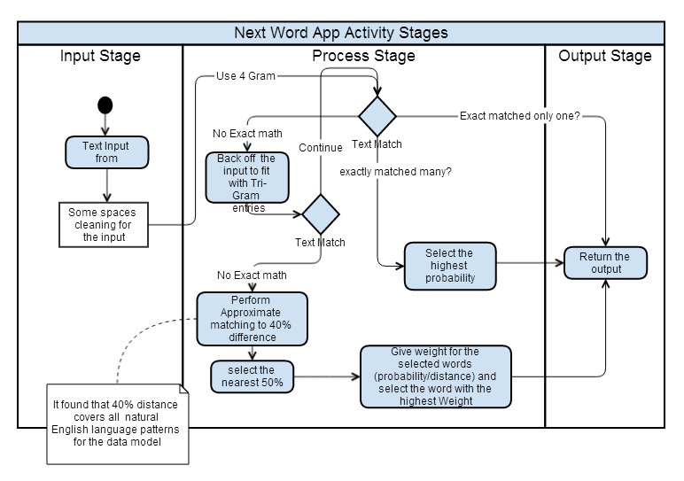

Next Word App
========================================================
author: Ahmed Shibrian
date: Firday, December 12th 2014
transition: rotate
transition-speed: slow

========================================================
transition: rotate
transition-speed: slow
## Overview
The Next Word App is a part of John Hopkins Data Science Specialization on Coursera
The App is used to predict the next word after any english language text.

**This presentation will show:**
- The prediction methodogy used  
- How application functions
- Issues to be solve in future

Before the presentation starts it would be good to tell that there is no perfect App.

To try the App [Here You Go](https://shibrain.shinyapps.io/JHK-SwiftKey-DataScience/)

The Prediction Model 
========================================================
transition: rotate
transition-speed: slow
left: 40%
**Data** 
--
  - The Model used Millions of records of Big Text Data from News, Blogs, and Twitter to generate the model.
  - The Data had been filtred and put in a mixed model of Tri and 4N grams (3 words and 4 words) and frequencies counted.
  
***

**Algorithms**
--
  - Probability of last word in gram calculated using [Naive Bayes](http://en.wikipedia.org/wiki/Naive_Bayes_classifier) algorithm.
  - The App uses *Back off* algorithm when 4gram doesn't match.
  - The App also uses [Approximate matching](http://en.wikipedia.org/wiki/Approximate_string_matching) (Fuzzy Matching) to match text pattern when no exact match found.
  - By using approximation probabilites get bies. For that a weight used instead. 

========================================================
transition: rotate
transition-speed: slow
## The App Logic

---

Further Work
========================================================
transition: rotate
transition-speed: slow
- **More text cleaning**
  - Although about 80% of the time consumed in data cleaning through natural language processing.
  - There is a need for more.
  - The more the data lookup is clean the better prediction.

- **More data**
  - Current model used about 2 million tweets, less than 1 million blogs, and less than 100K news article.
  - Bigger Data could lead to more accurate predictions
  
- **Specialized prediction**
  Because purpose matters 
